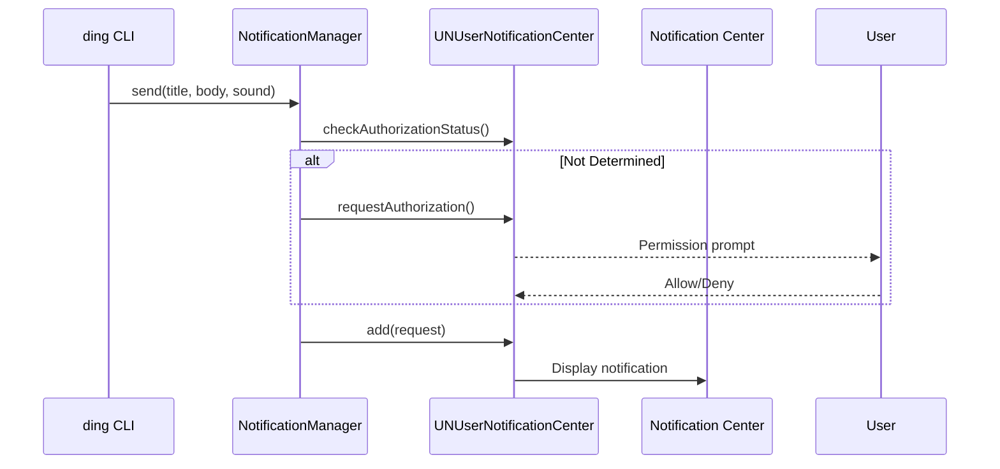

# Development Guide

## Architecture

Ding is a macOS app bundle that functions as a CLI tool. It uses `UNUserNotificationCenter` for native notifications (appears in System Settings → Notifications) and `ArgumentParser` for CLI parsing.

### Key Components

- **App Bundle**: `Ding.app` with proper `Info.plist` for notification permissions
- **UNUserNotificationCenter**: Native macOS notification API
- **ArgumentParser**: Apple's official CLI parsing library
- **sysctl/libproc**: Low-level macOS APIs for process tree inspection
- **JSON Config**: Direct manipulation of AI agent settings files

### Why an App Bundle?

macOS requires an app bundle with a valid `CFBundleIdentifier` for `UNUserNotificationCenter` to work properly. Benefits:

1. **Appears in Notification Settings**: Users can configure Ding's notifications in System Settings → Notifications → Ding
2. **Proper Permission Flow**: macOS prompts for notification permission on first use
3. **Reliable Delivery**: No dependency on `osascript` or external tools
4. **Future-Proof**: Uses Apple's recommended notification API

### Why Swift?

1. **Native macOS**: First-class support for macOS APIs and conventions
2. **Modern Language**: Type safety, async/await, clean syntax
3. **Small Binary**: ~1.6 MB release binary (vs 3.4 MB for .NET AOT)
4. **No Runtime**: Unlike .NET or Java, no additional runtime needed
5. **Maintained**: Actively developed by Apple, guaranteed macOS compatibility

### Why Not osascript?

The original implementation used `osascript` for notifications:
- Unreliable: Depends on Script Editor's notification permissions
- No dedicated settings: Notifications attributed to "Script Editor"
- Limited features: No custom icons, limited sound options

The app bundle approach solves all these issues.

## Building

### Prerequisites

- macOS 12.0+ (Monterey)
- Xcode Command Line Tools: `xcode-select --install`
- Swift 5.9+

### Build Commands

```bash
# Build Ding.app (debug)
./scripts/build-app.sh

# Build Ding.app (release, optimized)
./scripts/build-app.sh --release

# Just compile (no app bundle)
swift build -c release
```

### What build-app.sh Does

1. Runs `swift build -c release`
2. Creates `Ding.app/Contents/` structure
3. Copies binary to `Ding.app/Contents/MacOS/ding`
4. Copies `Info.plist` to `Ding.app/Contents/`
5. Copies icons to `Ding.app/Contents/Resources/icons/`

### Install Locally

```bash
# Build
./scripts/build-app.sh --release

# Install to Applications
cp -r Ding.app /Applications/

# Create CLI symlink
sudo ln -sf /Applications/Ding.app/Contents/MacOS/ding /usr/local/bin/ding

# Test
ding "Test" -t "Development"
```

## App Bundle Structure

```
Ding.app/
├── Contents/
│   ├── Info.plist              # Bundle metadata, notification keys
│   ├── MacOS/
│   │   └── ding                # The Swift binary
│   └── Resources/
│       ├── icons/              # Agent icons (PNG)
│       │   ├── claude.png
│       │   ├── copilot.png
│       │   └── ...
│       └── VERSION             # Version file
```

### Info.plist Keys

| Key | Purpose |
|-----|---------|
| `CFBundleIdentifier` | `com.ding.cli` - identifies app to macOS |
| `LSUIElement` | `true` - no dock icon, background app |
| `NSUserNotificationAlertStyle` | `alert` - enables notifications |

## Code Structure

```
Sources/ding/
├── main.swift              # CLI entry point, ArgumentParser commands
│   ├── Ding                - Root command
│   ├── Notify              - Send notification (default)
│   ├── Install             - Install agent hooks
│   ├── Uninstall           - Remove agent hooks
│   └── Status              - Show installation status
│
├── NotificationManager.swift
│   ├── requestPermission() - Ask for notification access
│   ├── checkAuthorizationStatus() - Check current permission
│   └── send()              - Post notification via UNUserNotificationCenter
│
├── AgentDetector.swift
│   ├── detect()            - Walk process tree
│   ├── getProcessInfo()    - Query process name/cmdline via sysctl
│   └── getParentPID()      - Get parent via proc_pidinfo
│
├── HookInstaller.swift
│   ├── HookTarget enum     - Claude, Gemini, Copilot
│   ├── detect()            - Check if agent config exists
│   ├── isInstalled()       - Check for existing hooks
│   ├── install()           - Add hook to config
│   └── uninstall()         - Remove hook from config
│
└── Presets.swift
    ├── Agent enum          - Known AI agents
    ├── Preset struct       - Title, icon, sound config
    └── iconURL()           - Locate icon in bundle/user dir
```

## Parent Process Detection

Ding walks the process tree to find known AI CLI tools:

| Process | Detection Method |
|---------|-----------------|
| Claude Code | `claude` in process name or `@anthropic` in command line |
| Gemini CLI | `gemini-cli`, `@google/gemini` in command line |
| Cursor | `cursor` in process name |
| Copilot/Codex | Process name match |

### Implementation

```swift
// Simplified detection flow
var currentPID = getppid()
while currentPID > 1 {
    let (name, cmdLine) = getProcessInfo(pid: currentPID)
    if matches(name, cmdLine) {
        return detectedAgent
    }
    currentPID = getParentPID(of: currentPID)
}
```

Uses:
- `getppid()` for direct parent PID
- `proc_pidinfo()` with `PROC_PIDTBSDINFO` for process info
- `sysctl()` with `KERN_PROCARGS2` for command line

## Notification Flow



## Hook Formats

### Claude Code (`~/.claude/settings.json`)

```json
{
  "hooks": {
    "Stop": [{
      "hooks": [{
        "type": "command",
        "command": "/Applications/Ding.app/Contents/MacOS/ding \"Claude finished\" -t \"Claude Code\"",
        "timeout": 5000
      }]
    }]
  }
}
```

### Gemini CLI (`~/.gemini/settings.json`)

```json
{
  "hooks": {
    "AfterAgent": [{
      "hooks": [{
        "type": "command",
        "command": "/Applications/Ding.app/Contents/MacOS/ding \"Gemini finished\" -t \"Gemini CLI\"",
        "timeout": 5000
      }]
    }]
  }
}
```

### GitHub Copilot (`.github/hooks/toasty.json`)

```json
{
  "version": 1,
  "hooks": {
    "sessionEnd": [{
      "type": "command",
      "bash": "ding 'Copilot finished' -t 'GitHub Copilot'",
      "timeoutSec": 5
    }]
  }
}
```

**Important**: Claude and Gemini require the nested `hooks` array structure!

## Icon Resolution

Icons are looked up in order:
1. `Ding.app/Contents/Resources/icons/<agent>.png` - App bundle (primary)
2. `~/.ding/icons/<agent>.png` - User-installed
3. `/usr/local/share/ding/icons/<agent>.png` - System-installed

## Versioning

Version is stored in `VERSION` file and read at runtime.

```bash
# Release a new version
./scripts/release.sh 1.2.0
git push origin main --tags
```

The release script:
1. Updates `VERSION` file
2. Commits the change
3. Creates git tag `v1.2.0`
4. GitHub Actions builds and publishes release

## Troubleshooting

### Notifications not appearing

1. Check System Settings → Notifications → Ding is enabled
2. Ensure Focus/Do Not Disturb is off
3. Run `ding "Test"` to trigger permission prompt

### "Ding" not in Notification Settings

It only appears after sending at least one notification:
```bash
/Applications/Ding.app/Contents/MacOS/ding "Test" -t "Test"
```

### Process detection not working

Use `--debug` flag:
```bash
ding "Test" --debug
```

### Build errors

```bash
# Ensure Xcode CLT is installed
xcode-select --install

# Reset package cache
swift package clean
swift package resolve
```

## Contributing

1. Fork the repository
2. Create a feature branch
3. Make changes
4. Run `./scripts/build-app.sh` to test
5. Submit a pull request

### Code Style

- Follow Swift API Design Guidelines
- Use `guard` for early returns
- Prefer `async/await` over callbacks
- Document public APIs with `///` comments
